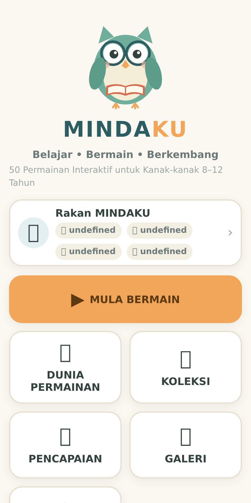
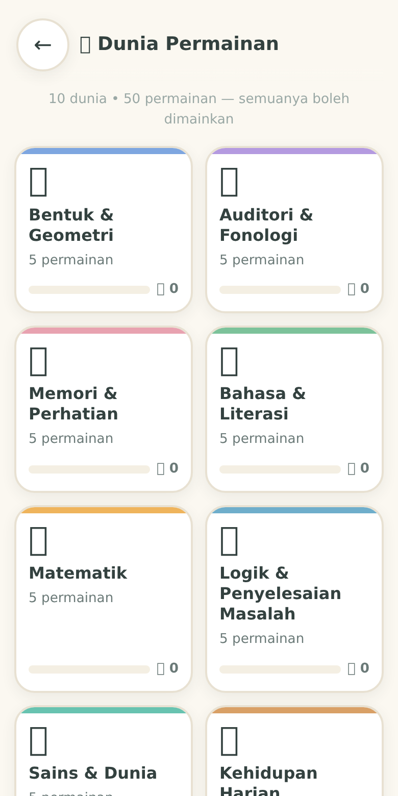
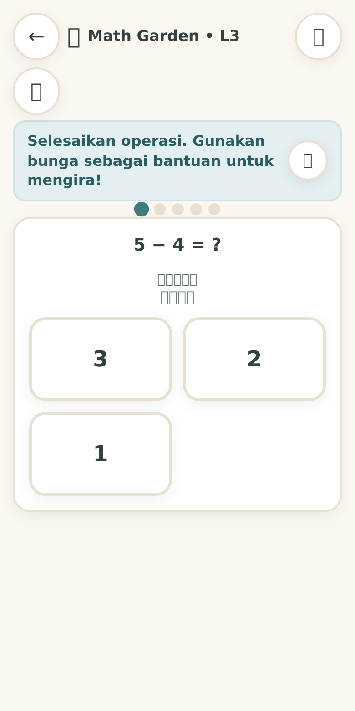
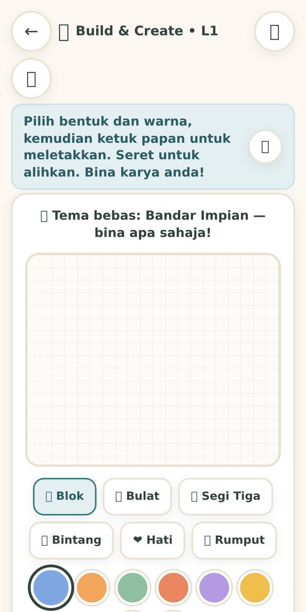

# 🦉 MINDAKU V.1

**MINDAKU** — aplikasi pembelajaran interaktif Bahasa Melayu untuk kanak-kanak **7–9 tahun** (Tahun 1–3).
Bermain di mana sahaja: **50 permainan** merentasi 10 kategori, **10 level × 3 tahap kesukaran sebenar** setiap satu,
boleh dipasang dan dimainkan **sepenuhnya luar talian** (PWA). Tiada iklan, tiada akaun, tiada hukuman negatif.

---

## ✨ Prinsip reka bentuk

- **Tanpa tekanan** — tiada nyawa hilang, tiada "salah = game over", tiada bunyi menakutkan. Kesilapan hanya menjemput cuba lagi.
- **Bantuan bukan penalti** — butang 💡 memberi petunjuk tanpa mengurangkan keseronokan; sistem penyesuaian menurunkan kesukaran selepas 2 kesilapan berturut dan menaikkan semula selepas 3 jawapan betul berturut.
- **Pemasa MATI secara sedia kala** — boleh dihidupkan dalam Tetapan untuk anak yang mahukan cabaran.
- **Kreativiti dihargai** — permainan kreatif (melukis, membina, mewarna) tidak memberi skor; hasil karya disimpan ke **Galeri Karya** anak.
- **Semua dalam Bahasa Melayu** — arahan, galakan, tahniah dan semua kandungan.

## 🎮 Kandungan

| # | Kategori | Contoh permainan |
|---|----------|------------------|
| 1 | Bentuk & Ruang | Geometry Builder, Symmetry Mirror, Pattern City |
| 2 | Matematik | Math Garden, Multiplication Garden, Smart Diner |
| 3 | Bahasa | Word Builder, Syllable Blocks, Word Analogy |
| 4 | Logik | Logic Puzzle, Odd One Out, Sequence Sleuth |
| 5 | Memori | Memory Match, Sound Detective, Picnic Memory |
| 6 | Sains | Weather Explorer, Plant Detective, Solar Mission |
| 7 | Alam Sekitar | Recycle Hero, Habitat Match, Animal Diet |
| 8 | Hidup Harian | Routine Builder, Organize Room, Pack School Bag |
| 9 | Keselamatan | Safe/Unsafe, Ask First, Road Safety, Personal Space |
| 10 | Emosi & Sosial | Emotion Detective, Calm Corner, Friendship |

Setiap permainan: **50 permainan berdaftar × 10 level × 3 kesukaran (Mudah/Sederhana/Cabaran) = 1,500 kombinasi**,
dan penjana kandungan menjana tugas baharu secara prosedural — tiada dua sesi sama.

## 📸 Pratonton

| | | |
|:---:|:---:|:---:|
|  |  |  |
|  |  |  |
|  |  |  |

*Tangkapan skrin dijana secara automatik — lihat `test/screenshots.js`.*

## 🚀 Cara jalankan

**Terbit ke web + bina APK (disyorkan):** lihat **[CARA-GITHUB-APK.md](CARA-GITHUB-APK.md)** —
panduan langkah demi langkah menempatkan aplikasi ini di GitHub Pages (pautan PWA boleh dimainkan)
dan membina APK Android secara automatik melalui GitHub Actions (sekali klik).

**Cara termudah (tempatan):**
```bash
node server.js          # http://localhost:8080
```
Pelayan statik tanpa sebarang kebergantungan; header `Service-Worker-Allowed: /` dipasang supaya PWA berfungsi sepenuhnya.

**Alternatif:** mana-mana pelayan statik pun boleh (contoh: `python3 -m http.server 8080`),
tetapi pastikan ia menghantar header `Service-Worker-Allowed: /` untuk fail `service-worker.js`,
jika tidak skop PWA terhad kepada subdirektori.

**Pasang sebagai aplikasi:** buka di Chrome/Edge (atau Safari iOS → Kongsi → Tambah ke Skrin Utama),
kemudian buka sekali lagi secara dalam talian supaya cache luar talian siap. Selepas itu **boleh dimainkan tanpa internet**.

## 🧪 Ujian

```bash
node test/logic-test.js       # ujian logik Node: 50 permainan × 10 level × 3 kesukaran + mod sandaran data
node test/browser-test.js     # ujian pelayar penuh (Puppeteer): 50 skrin dibuka,
node test/screenshots.js      # tangkapan skrin automatik 12 skrin → screenshots/
```

Ujian pelayar memerlukan `npm install puppeteer` (sekali sahaja) dan direktori `node_modules/`.
Liputan ujian pelayar:
- **Auto-main 28 permainan** — 23 daripada keenam-enam jenis enjin (kuiz, padan, memori, multi, tatasusun, susun)
  dan 5 permainan custom berfasa belajar (Picnic/Recipe/Shopping Memory, What Changed, Angle Explorer),
  semuanya dimainkan sehingga overlay tahniah muncul — aliran sebenar termasuk butang bantuan, semakan jawapan,
  penyiapan level dan penutupan overlay.
- **Kemajuan kekal selepas muat semula halaman** (IndexedDB disemak sebelum & selepas).
- Kemajuan + galeri IndexedDB, pendaftaran service worker dan **muat semula luar talian**.
- Semua skrin utama dibuka tanpa ralat konsol.

## 📁 Struktur

```
index.html            — aplikasi satu halaman (SPA tanpa binaan/framework)
css/                  — gaya (main.css, games.css, rewards.css, screens.css)
js/                   — teras: app, storage (IndexedDB), settings, accessibility, audio (WebAudio),
                        tts, profile, rewards, gallery, navigation, content-generator, game-engine, selftest
data/*.json           — bank kandungan (kosa kata, bentuk, bunyi, matematik, tabiat, keselamatan…)
games/*.js            — 50 takrif permainan (satu fail setiap satu)
pwa/                  — manifest.json + service-worker.js (cache-first, 83 fail dipracache)
icons/                — ikon aplikasi 5 saiz (favicon 48, 96, 192, 512, maskable-512)
assets-src/           — sumber reka bentuk: owl-icon.png (maskot AI lama) + icons-lama/ (ikon owl sebelumnya)
images/mascot.svg     — maskot burung hantu
audio/README.md       — nota bunyi sintesis (tiada fail audio luar)
test/                 — logic-test.js (Node vm) + browser-test.js (Puppeteer)
server.js             — pelayan statik ringkas untuk penghantaran
```

## 🔧 Ciri teknikal ringkas

- **Sifar kebergantungan** — tiada framework, tiada binaan; JS, CSS dan HTML tulen.
- **Offline-first** — service worker `cache-first` dengan penyegaran latar; semua 83 fail aplikasi dipracache.
- **Storan IndexedDB** — kemajuan, bintang, syiling, pelekat, trofi dan galeri karya kekal di peranti.
- **Pelbagai keperluan** — mod visual (kurang rangsangan), saiz teks, animasi boleh dimatikan, sokongan papan kekunci, ARIA.
- **Suara & bunyi** — sintesis WebAudio (tiada fail audio) + TTS pelayar; semuanya boleh dimatikan.
- **Penjana kandungan** — semua kuiz dijana secara prosedural dengan jaminan **tepat satu jawapan betul**;
  jika fail JSON gagal dimuat, bank sandaran terbina dalam mengambil alih supaya aplikasi tetap berfungsi.
